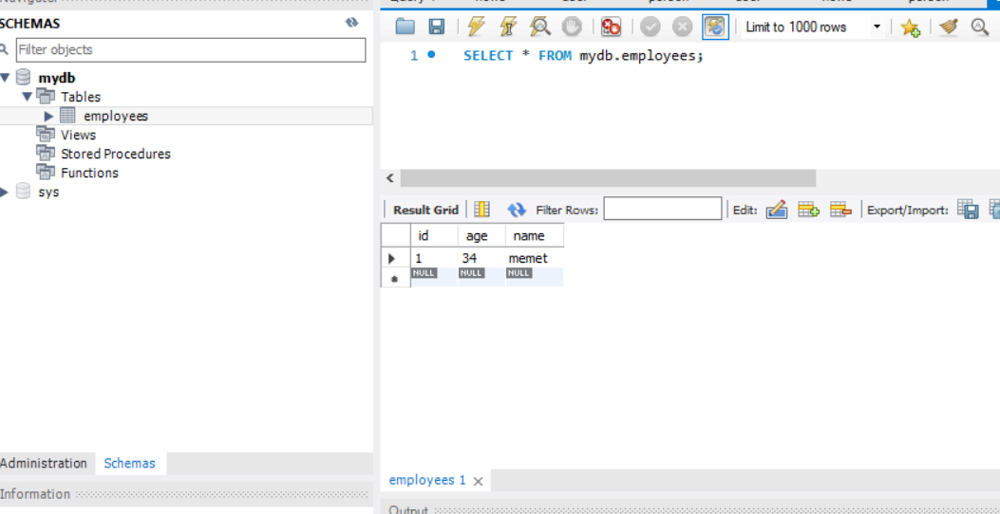

# Mysql veritabanına hibernate ile bağlantı
## Proje hakkında <a name = "about"></a>
Mysql veritabanına sadece hibernate ile bağlanıp, veri kaydetme işlemi yaptık
## Başlangıç <a name = "getting_started"></a> 
### Gerekli Programlar

```
Docker uygulamasını kurun
```

### Kurulum

Adım adım terminalden uygulayın

```
git clone https://github.com/abdullahciftci034/JavaConnectMysqlwithHibernate.git
```
```
cd JavaConnectMysqlwithHibernate
```
```
docker-compose build
```
```
docker-compose up
```
#### Uygulama hakkında 
Uygulama sadece bir kez çalışıp sonlanıyor, veriyi ekleyip bitiyor.

### İçerik

- [Hibernate](#Hibernate)
- [Mysql](#mysql)
- [Java](#java)
### Preview
